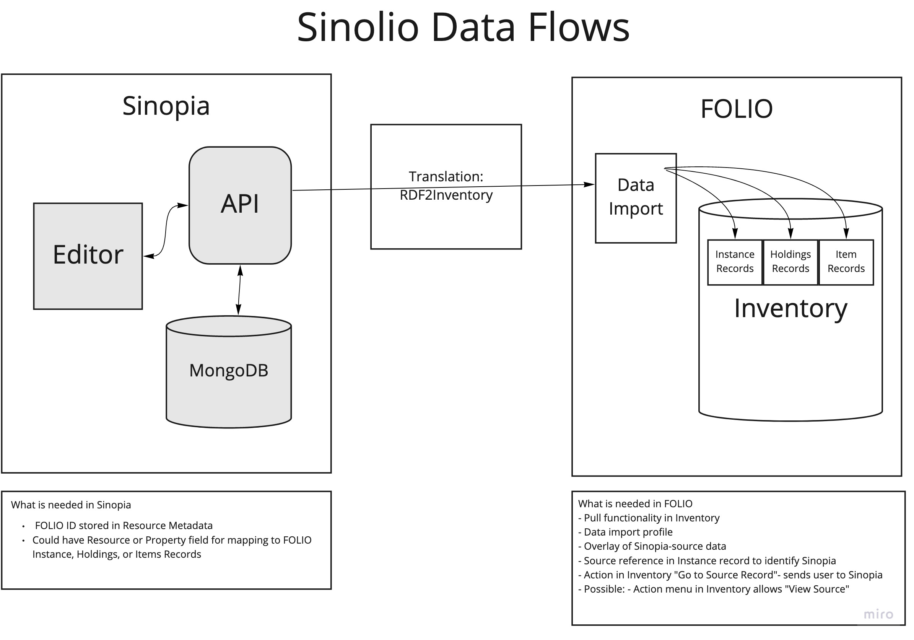

# Sinolio
## Sinopia and FOLIO Integration Pilot

This repository contains code, documentation, issues, and configuration for a 
pilot of integrating the [Sinopia](https://sinopia.io/) Linked Data Editor 
stack with the [FOLIO](https://www.folio.org/) library services platform.

## Sinopia/FOLIO API Integration
A high-level diagram of how Sinopia and FOLIO integration at the API level
where Sinopia retains it's independent authentication/authorization, data
persistence, and search while creating FOLIO Inventory's Instance, Holding,
and Item records:

